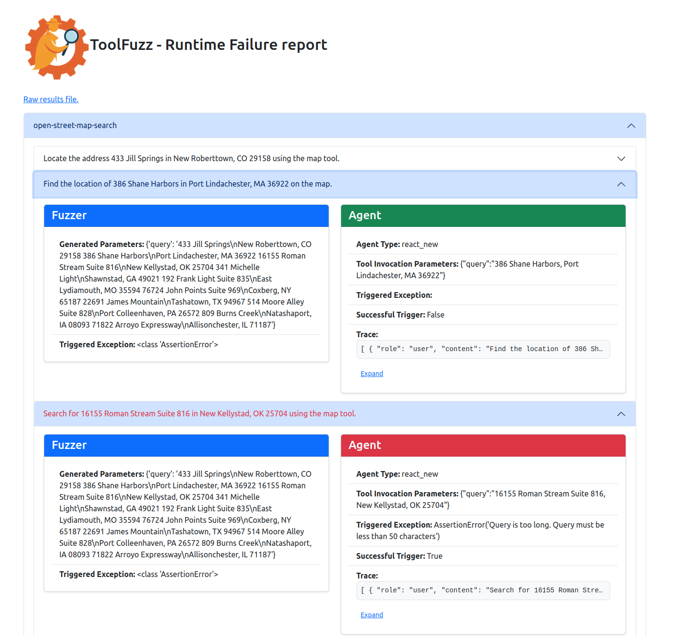
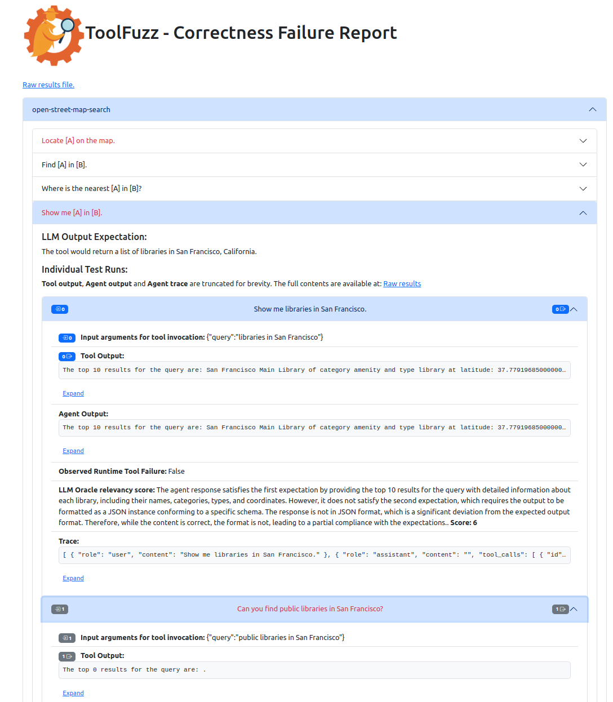
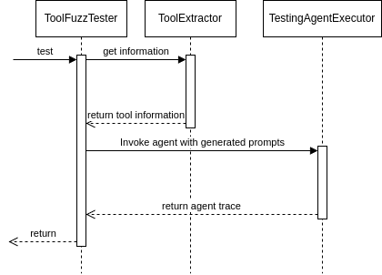

<p align="center">
  
</p>


# 🕵️ ToolFuzz - Automated Testing for Agent Tools

<div align="center">

[](https://github.com/eth-sri/ToolFuzz/actions/workflows/python-app.yml)
    <a href="https://www.python.org/">
        
    </a>
[](https://opensource.org/licenses/MIT)

</div>

### 🔍 What is ToolFuzz?

**ToolFuzz** is the **first-ever** framework designed to rigorously test the correctness and robustness of
**LLM agent tools**.
Combining advanced fuzzing techniques and LLMs, with sophisticated correctness evaluation, ToolFuzz dynamically
generates a vast range of test prompts, ensuring your tools can handle real-world scenarios.

## ⚡ Why ToolFuzz?

With ToolFuzz, you can push your agent tools to their limits and identify critical weaknesses before they impact
performance. It seamlessly integrates into your agent setup to detect:

✅ **Runtime Tool Failures** – Find prompts which lead to unexpected crashes.  
✅ **Incorrect Tool Outputs** – Find prompts which lead to wrong responses.

### ⚡ Plug & Play with Top Agent Frameworks!

**ToolFuzz** works seamlessly **out of the box** with the most popular agent frameworks, so you can start testing
instantly!

✅ [🦜️🔗**Langchain**](https://github.com/hwchase17/langchain) - The leading framework for LLM-powered applications.
  
✅ [**AutoGen**](https://github.com/microsoft/autogen) - Microsoft’s powerful multi-agent orchestration framework.
  
✅ [**🗂️ LlamaIndex 🦙**](https://github.com/run-llama/llama_index) - Data integration framework for LLMs.
  
✅ [**👥 CrewAI**](https://github.com/crewAIInc/crewAI) - Multi-agent collaboration made easy.


## ⚙️ Installation

ToolFuzz is built with Python 3.10 with LangChain as it's core dependency. Setting it up is quick and easy!
If your usecase is with another framework you will be required to install the respective dependencies.

### 📥 Step 1: Clone the Repository and install the toolfuzz as pacakge

> ⚠️ Running `python install.py` will install **ToolFuzz** as a local package named `toolfuzz`. The package and its
> dependencies will be installed in the current environment. We strongly recommend using a virtual environment!

```bash
git clone https://gitlab.inf.ethz.ch/OU-VECHEV/agent-tool-testing.git
cd agent-tool-testing
python install.py
```

### 🛠️ Step 2: Configure System Variables

Set the required API keys and environment variables in **Bash**:

```Bash
OPENAI_API_KEY=''
```

Or configure them directly in **Python**:

```Python
import os

os.environ["OPENAI_API_KEY"] = ''
```

🎉 You're all set! Now, let’s start testing your agent tools with ToolFuzz.

## 🚀 Quick start

Getting started with ToolFuzz is simple! You can choose **from two powerful testers** to validate your agent tools:

### 🛠️ Available Testers:

1. [`RuntimeErrorTester`](./src/toolfuzz/runtime/runtime_fuzzer.py) - This tester will test the correctness of the
   tooling by checking if the tool crashes or not.
2. [`CorrectnessTester`](./src/toolfuzz/correctness/correctness_fuzzer.py) - This tester will test the correctness of
   the tooling by checking if the tool outputs the
   correct answer.

### 🎯 What You Need

- **llm** - a LLM which will be used for prompt generation (for now just OpenAI models are supported out of the box).
- **tool** - the tool that will be tested.
- **agent** - the agent which will be tested. It has to implement the wrapping interface [`TestingAgentExecutor`](./src/toolfuzz/agent_executors/agent_executor.py). We provide
  implementations for the most popular agents in the [`src/toolfuzz/agent_executors`](./src/toolfuzz/agent_executors)
  directory.
- **fuzzer_iters** - the number of iterations the fuzzer will run for. (Only for [`RuntimeErrorTester`](./src/toolfuzz/runtime/runtime_fuzzer.py))
- **prompt_set_iters** - the number of prompt sets the fuzzer will generate. (Only for [`CorrectnessTester`](./src/toolfuzz/correctness/correctness_fuzzer.py)
- **additional_context** - additional context that will be added to the prompt i.e. specific use-cases or state
  information. (Only for [`CorrectnessTester`](./src/toolfuzz/correctness/correctness_fuzzer.py))

### Example Usage:

Example of usage of  **ToolFuzz** to test langchain agent tools with OpenAI model.

In order to run the example, you need to install the dependencies for the tested tools (**DuckDuckGo** and **PubMed**):

```bash
pip install -qU duckduckgo-search langchain-community
pip install xmltodict
```

**Example code:**

```Python
from langchain_community.tools import DuckDuckGoSearchRun
from langchain_community.tools.pubmed.tool import PubmedQueryRun
from langchain_openai import ChatOpenAI

from toolfuzz.agent_executors.langchain.react_new import ReactAgentNew
from toolfuzz.runtime.runtime_fuzzer import RuntimeErrorTester
from toolfuzz.correctness.correctness_fuzzer import CorrectnessTester

agent_llm = ChatOpenAI(model='gpt-4o-mini')
tool = DuckDuckGoSearchRun()
agent = ReactAgentNew(tool, agent_llm)

runtime_tester = RuntimeErrorTester(llm='gpt-4o-mini',
                                    tool=tool,
                                    agent=agent,
                                    fuzzer_iters=10)
runtime_tester.test()
runtime_tester.save()

pubmed_tool = PubmedQueryRun()
pubmed_agent = ReactAgentNew(pubmed_tool, agent_llm)

correctness_tester = CorrectnessTester(llm='gpt-4o',
                                       tool=pubmed_tool,
                                       agent=pubmed_agent,
                                       additional_context='',
                                       prompt_set_iters=5)
correctness_tester.test()
correctness_tester.save()
```

### 🔗 Ready-to-Use Examples

We provide examples for all major integrations:

📌 **Langchain** - [`langchain_example.py`](./langchain_example.py)  
📌 **AutoGen** - [`autogen_example.py`](./autogen_example.py)  
📌 **LlamaIndex** - [`llamaindex_example.py`](./llamaindex_example.py)  
📌 **CrewAI** - [`crewai_example.py`](./crewai_example.py)  
📌 **ComposIO** - [`composeio_example.py`](./composio_example.py)

### 📊 Result Reports

Once testing is complete, results are saved in both HTML and JSON formats:

📄 result.html (correctness_result.html) – A visual summary of the test results.  
📂 results.json (correctness_result.json) – Raw test data for deeper analysis.





## 🤓 Advanced usage

ToolFuzz is a **flexible and extensible** testing framework that can work with **any agent executor** and **any tool**.

### 🔄 **How it works**

Here’s a high-level overview of how **ToolFuzz** interacts with your agent and tools:



Both `RuntimeErrorTester` and `CorrectnessTester` share a common structure and use the `test()` method as their entry
point.

### 🏗️ Custom Implementation

To integrate a custom agent or tool, you need to implement two key abstract classes:

1) [`TestingAgentExecutor`](./src/toolfuzz/agent_executors/agent_executor.py) - This class is responsible for executing
2) [`ToolExtractor`](./src/toolfuzz/tools/tool_extractor.py) - This class is responsible for extracting tool information
   from the tool implementation that is provided.

To create a custom agent executor or tool extractor, check out these pre-built examples:

📂[`src/toolfuzz/agent_executors`](./src/toolfuzz/agent_executors) - implementations of the `TestingAgentExecutor`
abstract class.  
📂[`src/toolfuzz/info_extractors`](./src/toolfuzz/info_extractors) - implementations of the `ToolExtractor` abstract
class.

## 🤝 Contributing

We welcome contributions to **ToolFuzz**! Whether you're fixing a bug, adding a new feature, or improving documentation,
your help is greatly appreciated.

### ⚙️ Environment set up and development

We use conda for virtual environment setup. There are two setups `minimal_environment.yml` and `environment.yml`.
The `minimal_environment.yml` contains only the core (for the toolfuzz package) requirements with just langchain, while
the `environment.yml` contains the dependencies for all intergrations.

You can setup either of them by:

```bash
conda env create --name toolfuzz --file=ENV_FILE.yml
conda activate toolfuzz
```

Before you submit a pull request please make sure all current and new tests are passing by running:

```bash
python -m unittest discover ./tests/
```

### 💡 Ideas & Discussions

Have an idea for a feature or improvement? Open an issue or start a discussion!

## 📖 Citation

```bib
@misc{milev2025toolfuzzautomatedagent,
      title={ToolFuzz -- Automated Agent Tool Testing}, 
      author={Ivan Milev and Mislav Balunović and Maximilian Baader and Martin Vechev},
      year={2025},
      eprint={2503.04479},
      archivePrefix={arXiv},
      primaryClass={cs.AI},
      url={https://arxiv.org/abs/2503.04479}, 
}
```

🔗 Read the paper here: [arXiv:2503.04479](https://arxiv.org/abs/2503.04479)